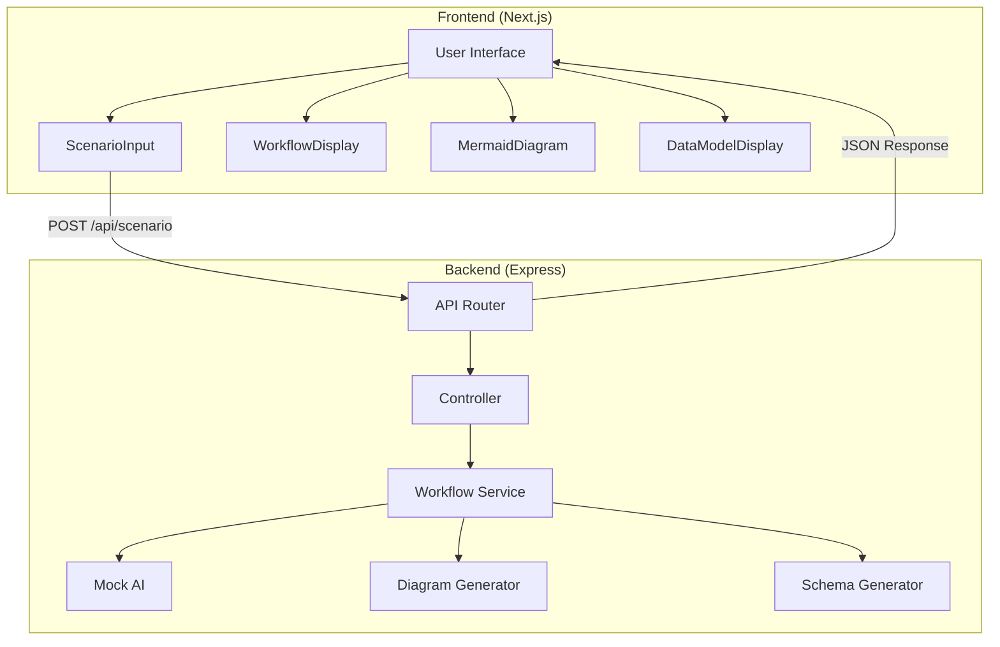
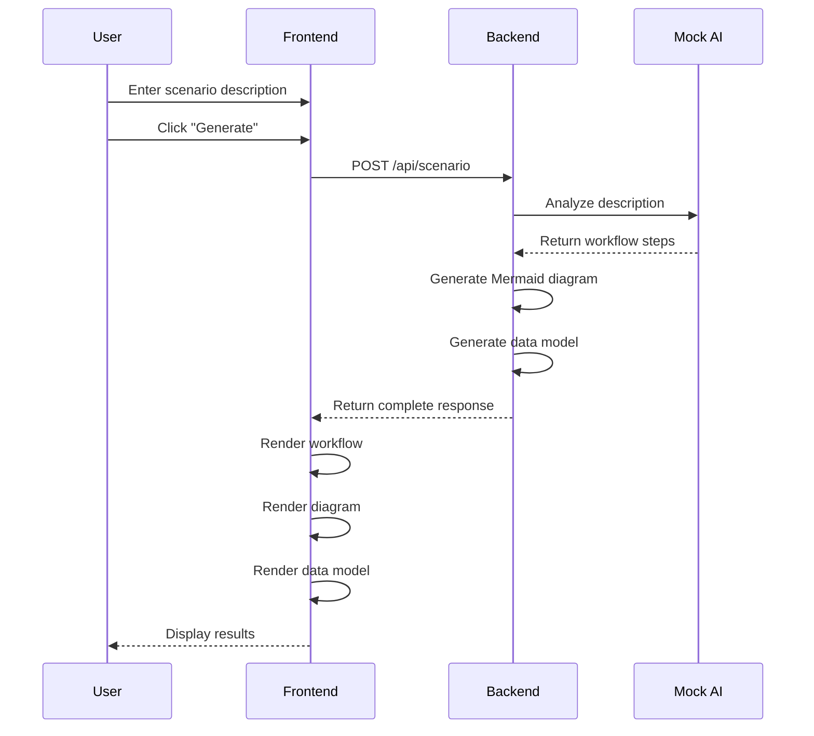

# 🤖 AI Scenario Builder

> Transform any scenario description into a structured workflow, visual diagram, and data model — powered by AI.


## 📖 What is this?

**AI Scenario Builder** is a demonstration of AI-assisted development. Give it any scenario description (business process, technical workflow, personal task), and it will automatically generate:

1. ✅ **Structured Workflow** - Step-by-step breakdown with types and descriptions
2. 📊 **Visual Diagram** - Mermaid flowchart showing the process flow
3. 🗃️ **Data Model** - JSON schema with entities and relationships
4. 📝 **Summary** - Human-readable explanation of the workflow

## 🎯 Perfect For

- **Business analysts** wanting to visualize processes
- **Developers** exploring AI-assisted code generation
- **Product managers** mapping user journeys
- **Students** learning about system design
- **Anyone** curious about AI capabilities

## 🚀 Quick Start

### Prerequisites

- Node.js 18+ installed
- npm or yarn package manager

### Installation

```bash
# Clone the repository
git clone https://github.com/your-username/ai-scenario-builder.git
cd ai-scenario-builder

# Install backend dependencies
cd backend
npm install

# Install frontend dependencies
cd ../frontend
npm install
```

### Running the App

**Terminal 1 - Start the Backend:**
```bash
cd backend
npm start
```
> Backend runs at http://localhost:3001

**Terminal 2 - Start the Frontend:**
```bash
cd frontend
npm run dev
```
> Frontend runs at http://localhost:3000

### Using the App

1. Open http://localhost:3000 in your browser
2. Type a scenario description (e.g., "Build an e-commerce checkout flow")
3. Click "Generate Scenario"
4. Explore the workflow, diagram, and data model tabs

## 📁 Project Structure

```
ai-scenario-builder/
├── backend/                    # Express.js API server
│   ├── src/
│   │   ├── index.js           # Server entry point
│   │   ├── controllers/       # HTTP request handlers
│   │   │   └── scenarioController.js
│   │   ├── services/          # Business logic
│   │   │   └── workflowService.js
│   │   ├── routes/            # API route definitions
│   │   │   └── scenarioRoutes.js
│   │   └── utils/             # Utility functions
│   │       ├── mockAI.js      # Mock AI generator (replaceable)
│   │       ├── diagramGenerator.js
│   │       └── schemaGenerator.js
│   └── tests/                 # Test files
│       ├── workflow.test.js
│       └── api.test.js
│
├── frontend/                   # Next.js application
│   └── src/
│       ├── app/               # Next.js App Router
│       │   ├── layout.tsx     # Root layout
│       │   ├── page.tsx       # Main page
│       │   └── globals.css    # Global styles
│       ├── components/        # React components
│       │   ├── ScenarioInput.tsx
│       │   ├── WorkflowDisplay.tsx
│       │   ├── MermaidDiagram.tsx
│       │   └── DataModelDisplay.tsx
│       └── lib/               # Utilities
│           ├── api.ts         # API client
│           └── types.ts       # TypeScript types
│
└── README.md                  # This file
```

## 🔌 API Reference

### POST /api/scenario

Generate a complete scenario breakdown from a description.

**Request:**
```json
{
  "description": "Build a user authentication flow with login and signup"
}
```

**Response:**
```json
{
  "success": true,
  "data": {
    "workflow": [
      {
        "id": 1,
        "name": "Enter Credentials",
        "description": "User enters username/email and password",
        "type": "user_input"
      }
      // ... more steps
    ],
    "mermaid_diagram": "graph TD\n  step1[\"Enter Credentials\"] --> step2[\"Validate Input\"]\n  ...",
    "data_model": {
      "entities": {
        "User": { ... },
        "Session": { ... }
      },
      "relationships": [...]
    },
    "summary": "This authentication workflow securely handles user login..."
  }
}
```

### GET /health

Check if the backend is running.

**Response:**
```json
{
  "status": "healthy",
  "timestamp": "2024-01-15T10:30:00.000Z"
}
```

## 🏗️ Architecture



## 📊 Sequence Diagram



## 🔄 How the AI Flow Works

### Current Implementation (Mock AI)

The project currently uses a **mock AI** (`backend/src/utils/mockAI.js`) that:

1. **Analyzes keywords** in your description
2. **Detects scenario type** (e-commerce, auth, booking, etc.)
3. **Returns pre-built templates** matching the detected type
4. **Generates contextual summaries**

This approach is deterministic and works offline, perfect for demos and testing.

### Integrating a Real LLM

To use a real AI (like OpenAI), modify `mockAI.js`:

```javascript
const OpenAI = require('openai');
const openai = new OpenAI({ apiKey: process.env.OPENAI_API_KEY });

async function realAIGenerate(description) {
  const response = await openai.chat.completions.create({
    model: "gpt-4",
    messages: [
      { 
        role: "system", 
        content: `You are a workflow architect. Given a scenario description,
                  return a JSON object with:
                  - workflow: array of {id, name, description, type}
                  - summary: string explanation`
      },
      { role: "user", content: description }
    ],
    response_format: { type: "json_object" }
  });
  return JSON.parse(response.choices[0].message.content);
}
```

### Supported Scenario Types

| Type | Trigger Keywords | Example |
|------|-----------------|---------|
| E-commerce | shop, cart, buy, purchase | "Online store checkout" |
| Authentication | login, signup, password | "User registration flow" |
| Booking | book, reserve, appointment | "Doctor appointment system" |
| Support | ticket, help, issue | "Customer support workflow" |
| Content | post, blog, publish | "Blog publishing process" |
| Workflow | approval, review, task | "Document approval flow" |
| Data | import, export, sync | "Data migration pipeline" |
| Notification | notify, alert, email | "Notification system" |

## 🧪 Running Tests

```bash
cd backend
npm test
```

Tests cover:
- ✅ Mock AI analysis and generation
- ✅ Mermaid diagram syntax generation
- ✅ Data model schema generation
- ✅ API endpoint validation
- ✅ Error handling

## 🎨 Customization

### Adding New Scenario Types

Edit `backend/src/utils/mockAI.js`:

```javascript
// 1. Add detection keywords
const types = {
  // ... existing types
  your_type: ['keyword1', 'keyword2', 'keyword3']
};

// 2. Add workflow template
const templates = {
  // ... existing templates
  your_type: [
    { id: 1, name: 'Step 1', description: '...', type: 'trigger' },
    // ... more steps
  ]
};

// 3. Add summary
const summaries = {
  // ... existing summaries
  your_type: 'Description of this workflow type...'
};
```

### Styling the Frontend

- **Colors**: Edit `frontend/src/app/globals.css`
- **Components**: Modify files in `frontend/src/components/`
- **Layout**: Update `frontend/src/app/layout.tsx`

## 🤝 Contributing

1. Fork the repository
2. Create a feature branch: `git checkout -b feature/amazing-feature`
3. Make your changes
4. Run tests: `npm test`
5. Commit: `git commit -m 'Add amazing feature'`
6. Push: `git push origin feature/amazing-feature`
7. Open a Pull Request

## 📜 License

This project is licensed under the MIT License - see the [LICENSE](LICENSE) file for details.

## 🙏 Acknowledgments

- Built with [Next.js](https://nextjs.org/)
- Backend powered by [Express.js](https://expressjs.com/)
- Diagrams rendered with [Mermaid](https://mermaid.js.org/)
- Styled with [Tailwind CSS](https://tailwindcss.com/)

---

**Built with 💙 to demonstrate AI-assisted development**
